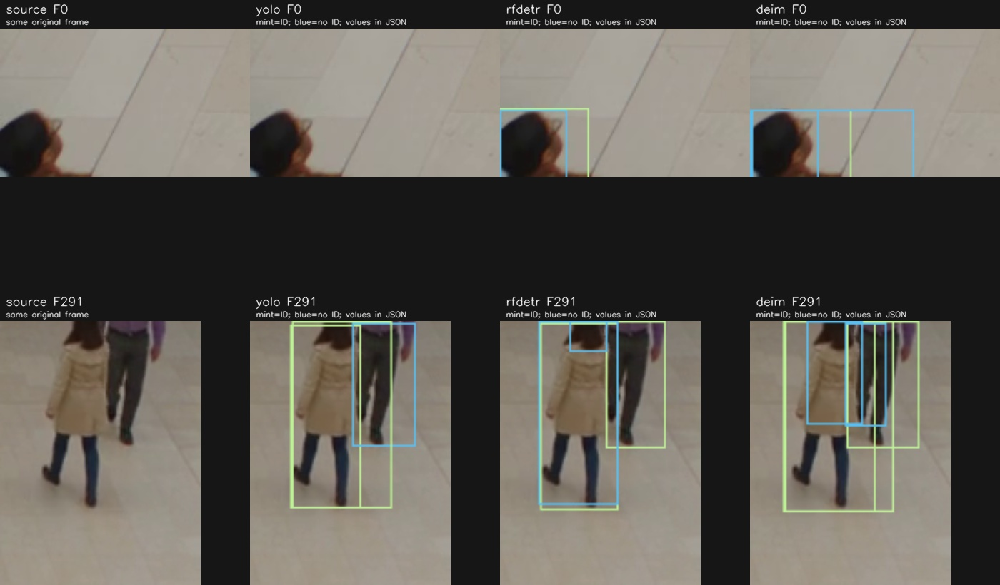

# 모델 비교 — 2026-09-15

[뷰어](https://visioneye-lab.vercel.app) · [원자료](../experiments/results/2026-09-15/) · [재현](EXPERIMENT_REPRODUCTION.md) · [설계](NEXT_EXPERIMENTS.md)

YOLO26n, RF-DETR Small, DEIMv2-S와 ByteTrack / TrackTrack / TrackTrack+ReID를 실행했다. **영상 2개·고유 602프레임·조건별 3회**이며, 같은 영상을 반복한 것을 독립 표본으로 계산하지 않는다. 검출 파이프라인 5,418프레임과 캐시 추적 5,418프레임을 처리했다. 새 학습이나 평가 영상에 맞춘 임계값 조정은 하지 않았다.

## 검출기

각 검출기 뒤에 동일 ByteTrack과 출입 집계기를 연결했다. confidence 0.1, 아래 방향 IN, 출입선 (128,396)→(1152,396), 경계 여유 8px을 고정했다. 모델별 권장 입력과 정밀도가 달라 **동일 연산량·동일 정밀도의 아키텍처 비교는 아니다**.

| 검출기 | 입력 · 정밀도 | 다인 IN / OUT | 2인 IN / OUT | 다인 처리 FPS 중앙값 (범위) | 다인 추적 ID |
|---|---|---:|---:|---:|---:|
| YOLO26n | 640 · FP16 | 4 / 8 | 1 / 1 | 60.89 (58.61–61.23) | 22 |
| RF-DETR Small | 512 · FP32, eager | 4 / 8 | 1 / 1 | 31.66 (31.04–33.40) | 21 |
| DEIMv2-S | 640 · FP32, deploy conversion | 4 / 8 | 1 / 1 | 18.29 (15.73–20.88) | 24 |

모든 반복에서 위 집계와 ID 개수가 같았다. ID 개수는 실제 고유 인원이나 분절률이 아니다. 2인 영상 처리 FPS 중앙값은 각각 67.01, 31.07, 21.57이며 ID는 2, 2, 3개였다. RF-DETR FP16 최적화나 TensorRT는 실행하지 않았다.

**계측 범위:** 같은 RTX 4090에서 GPU 작업을 순차 실행했다. 읽기·검출·추적·집계·JSONL 기록을 포함하고, 모델 초기화·첫 프레임 5회 워밍업·렌더링·영상 인코딩을 제외한다. CUDA 완료까지 동기화했다. 기존 데모의 24.08 FPS는 solid 대시보드 렌더·저장을 포함하므로 직접 비교하지 않는다. 사용 중인 데스크톱이며 전용 격리 벤치마크는 아니다. 3회 범위를 공개하고, 촬영→표시 지연이나 현장 실시간 성능으로 해석하지 않는다.

## 추적기

YOLO26n 첫 번째 실행의 같은 박스·점수를 재사용했다. 원본 602프레임 × 3개 설정 × 3회, 총 5,418개 프레임 기록에서 순서·시각·박스·점수가 일치했다. TrackTrack ON/OFF 설정은 `with_reid` 외 동일하며 카메라 이동 보정은 껐다. 공식 ReID ONNX와 CUDAExecutionProvider, 실제 224×224 crop을 사용했다.

| 추적기 | 다인 IN / OUT | 다인 추적 ID | 추적 p50 ms | 추적 p95 ms |
|---|---:|---:|---:|---:|
| ByteTrack | 4 / 8 | 22 | 0.720 | 1.607 |
| TrackTrack | 4 / 8 | 18 | 1.307 | 3.004 |
| TrackTrack + ReID | 4 / 8 | 18 | 16.333 | 98.002 |

지연 값은 각 반복의 분위수를 낸 뒤 3회 중앙값으로 요약했다. **검출을 제외한 추적 단계 지연**이다. 캐시 재생 FPS를 전체 추론 FPS로 표시하지 않는다. 2인 영상은 세 설정 모두 IN 1 / OUT 1, ID 2개였다.

TrackTrack ReID ON/OFF는 두 클립의 **모든 프레임 ID 할당까지 동일**했다. 이 데이터에서는 ReID의 추가 이득이 관측되지 않았다. 기존 코트 인물의 ByteTrack ID16/35 중복은 F287–291에서 보이며 이후 35로 바뀐다. TrackTrack은 기존 ID12로 복귀하지만 F291–293의 박스는 ID 미확정이다. 따라서 중복 ID 감소와 순간적인 추적 공백을 함께 기록한다. 전체 사람의 ID 정확도를 평가한 결과는 아니다. [상세 관찰](../experiments/results/2026-09-15/tracker-review.md)

## 출입 시각 대조

기존 AI 원본 시각 검수 14건의 구간은 바꾸지 않았다. 자동 대조는 **클립·방향·시각의 일대일 대응**이며, 인물 정체가 같은지까지 검증하지 않는다.

- YOLO26n / DEIMv2-S / TrackTrack / TrackTrack+ReID: 기존 구간 14 / 14 대응.
- RF-DETR Small: 기존 구간 13 / 14, 구간을 ±0.5초 확장한 보조 대조 14 / 14.
- RF-DETR의 초록 상의 OUT은 3.583초로, 기존 3.333–3.500초 구간보다 약 0.083초 늦었다. 집계 총수는 같으며, 이를 곧바로 다른 사람의 오출입으로 해석하지 않는다.

사람 검수자 합의, 전체 프레임 박스·ID·마스크 정답은 없다. 따라서 precision/recall, HOTA, IDF1, 검출 누락률, 절대 재실 정확도는 산출하지 않았다. 원본의 가장자리 잘림과 생성 영상 특성도 그대로 유지했다.

## 국소 검토

첫 프레임 왼쪽 아래의 잘린 인물에는 YOLO 박스가 없고 RF-DETR는 2개, DEIMv2는 3개의 겹친 박스를 냈다. 해당 인물을 새로 검출한 동시에 중복도 생긴 것이다. F291 코트 영역에는 세 검출기 모두 겹친 박스 2개가 남았다. 두 프레임 관찰을 전체 검출 재현율로 확대하지 않는다.

## 판단

이 두 영상에서 출입 집계는 새 검출기로 바꿔도 같았다. 현재 앱의 후속 검증 대상으로는 **YOLO26n + TrackTrack, ReID OFF**가 합리적이다. 관측된 코트 ID 분절을 줄였고 ReID ON과 같은 결과를 더 낮은 추적 비용으로 냈다. 현장 성능 우위나 일반적인 모델 순위는 아니다. 기본 앱의 ByteTrack 설정은 아직 변경하지 않았다.

SAM 3.1은 공식 체크포인트가 승인 대상이고 HTTP 401 `GatedRepoError`로 다운로드가 거부돼 **실행하지 못했다**. 임의 재배포 가중치나 다른 모델로 대체하지 않았다. [접근 상태](../experiments/results/2026-09-15/sam-status.json)

다음 단계는 실제 영상과 사람 검수 GT 보강, 가림·머뭇거림·재등장 평가, 동일 정밀도 또는 추론 최적화 비교다. 현재 결과를 바탕으로 평가 영상 임계값을 다시 맞추지는 않았다.
